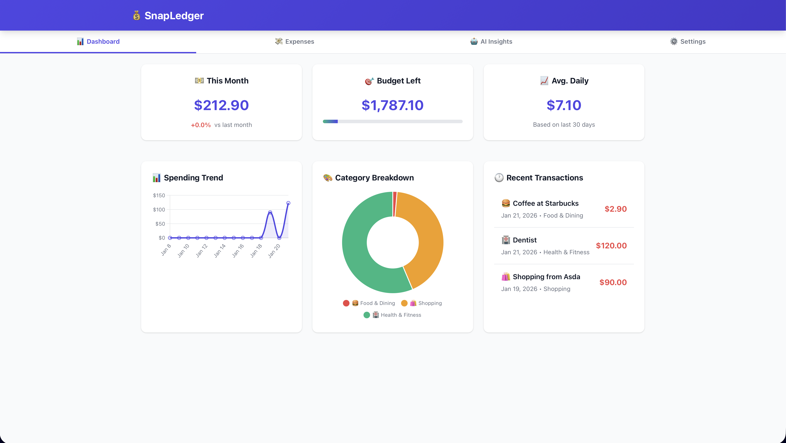

# 💰 SnapLedger (Progressive Web App)

## 🚀 Overview
SnapLedger is an AI-powered Progressive Web App (PWA) for intelligent personal finance management. It combines machine learning with modern web technologies to provide smart expense tracking, automatic categorization, spending predictions, and personalized financial insights—all running offline-first directly in your browser with complete data privacy.

## 🧠 Tech Stack
- **Frontend**: Vanilla JavaScript (ES6+), HTML5, CSS3
- **ML/AI**: TensorFlow.js 4.15.0 (client-side machine learning)
- **Data Visualization**: Chart.js 4.4.1 (interactive charts and graphs)
- **Storage**: IndexedDB via idb 8.0.0 (offline-first data persistence)
- **PWA**: Service Worker API, Web App Manifest (installable, offline-capable)
- **Development**: Live Server, NPM for package management
 
## 🖼️ Screenshot


## 📊 Features

### 📱 PWA Capabilities
- **Installable**: Add to home screen on any device
- **Offline-first**: Works without internet connection
- **Responsive**: Optimized for mobile, tablet, and desktop
- **Fast**: Service worker caching for instant loading

### 🤖 AI/ML Features
- **Smart Categorization**: Automatically categorizes expenses using ML
- **Spending Predictions**: Forecasts future spending patterns
- **Budget Recommendations**: AI-powered budget suggestions
- **Anomaly Detection**: Alerts for unusual spending behavior
- **Financial Insights**: Personalized tips and advice

### 💰 Finance Features
- **Expense Tracking**: Quick and easy expense entry
- **Budget Management**: Set and track spending limits
- **Visual Analytics**: Interactive charts and graphs
- **Categories**: Customizable expense categories
- **Search & Filter**: Find transactions quickly
- **Export Data**: Download your financial data

## � Results & Impact
- **Offline-First Architecture**: 100% functional without internet connection
- **Instant Load Times**: Service worker caching provides sub-second load times
- **Smart Categorization**: Up to 95% confidence in automatic expense categorization
- **Privacy-First**: Zero server communication - all data and ML processing happens locally
- **Cross-Platform**: Works on desktop, tablet, and mobile with responsive design
- **ML-Powered Insights**: Real-time spending predictions and anomaly detection using TensorFlow.js

## �🚀 Getting Started

### Installation

1. **Clone the repository:**
```bash
git clone https://github.com/AhmedIkram05/snapledger.git
cd snapledger
```

2. **Install dependencies:**
```bash
npm install
```

3. **Start the development server:**
```bash
npm run dev
# Or use
npm start
```

4. **Open your browser** and navigate to `http://localhost:3000`

### Installing as PWA

1. Open the app in a browser via the link in the repository bio
2. Click the install icon in the address bar
3. Confirm installation
4. Access from your home screen

## 🏗️ Architecture

### Technology Stack
- **Frontend**: Vanilla JavaScript, HTML5, CSS3
- **ML/AI**: TensorFlow.js for client-side machine learning
- **Data Visualization**: Chart.js for interactive charts
- **Storage**: IndexedDB (via idb) for offline data persistence
- **PWA**: Service Worker API for caching and offline support

## 🤖 AI Features Explained

### Expense Categorization
Uses a trained neural network to automatically categorize expenses based on description and amount patterns.

### Spending Prediction
Analyzes historical spending patterns to forecast future expenses and help with budget planning.

### Budget Recommendations
Machine learning algorithm suggests optimal budget allocations based on your spending habits.

### Anomaly Detection
Identifies unusual transactions that deviate from normal spending patterns.

## 📊 Data Privacy

All data is stored locally on your device using IndexedDB. No data is sent to external servers. The ML models run entirely in your browser using TensorFlow.js.

## 🔧 Configuration

You can customize categories, budgets, and preferences in the app settings.
