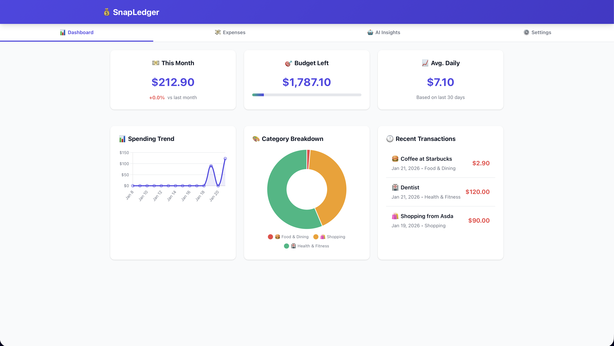

# SnapLedger

**Offline-first personal finance PWA with client-side ML — no data ever leaves your device.**

[](https://ahmedikram05.github.io/snapledger/)

---

## What It Does

SnapLedger is a budget tracking PWA that runs entirely in the browser. ML inference happens client-side via TensorFlow.js — no backend, no API calls, no data uploaded anywhere. It works offline, installs to your home screen, and loads in under a second thanks to service worker caching.

The ML layer handles three things: automatic expense categorisation based on description and amount patterns, monthly spending forecasts from historical data, and anomaly detection that flags transactions that deviate from your normal behaviour.

---

## Tech Stack

| Layer | Technology |
|---|---|
| Frontend | Vanilla JavaScript (ES6+), HTML5, CSS3 |
| ML / AI | TensorFlow.js 4.15.0 — client-side inference |
| Charts | Chart.js 4.4.1 |
| Storage | IndexedDB via idb 8.0.0 |
| PWA | Service Worker API + Web App Manifest |

---

## Features

**Finance**
- Add, categorise, and search transactions
- Set per-category budget limits and track against them
- Visual breakdowns via interactive Chart.js graphs
- Export data to CSV

**ML / AI (all client-side)**
- Smart expense categorisation from description + amount
- Monthly spending prediction from usage history
- Anomaly detection for unusual transactions
- AI budget suggestions based on spending patterns

**PWA**
- Installable on desktop and mobile (add to home screen)
- Fully offline — service worker caches assets and data
- Responsive across mobile, tablet, and desktop
- Sub-second load after first visit

---

## Screenshot



---

## Getting Started

```bash
git clone https://github.com/AhmedIkram05/snapledger.git
cd snapledger
npm install
npm start
```

Open `http://localhost:3000` in your browser.

> **Note:** Service Workers require HTTPS or localhost. If you use a different port, update `sw.js` accordingly.

**Or just use the live demo:** [ahmedikram05.github.io/snapledger](https://ahmedikram05.github.io/snapledger/)

### Install as PWA

1. Open the live demo in Chrome or Edge
2. Click the install icon in the address bar
3. Confirm — it will appear on your home screen / desktop

---

## Project Structure

```
snapledger/
├── index.html          # App shell
├── manifest.json       # PWA manifest
├── sw.js               # Service worker (caching + offline)
├── css/                # Stylesheets
├── js/                 # App logic + TensorFlow.js models
│   ├── app.js          # Core application
│   ├── ml.js           # TensorFlow.js inference
│   ├── charts.js       # Chart.js visualisations
│   └── db.js           # IndexedDB wrapper
└── assets/icons/       # PWA icons + screenshots
```

---

## Data Privacy

All data is stored in your browser's IndexedDB. Nothing is sent to a server. ML models run entirely in-browser via TensorFlow.js. Uninstalling the app or clearing site data removes everything.
